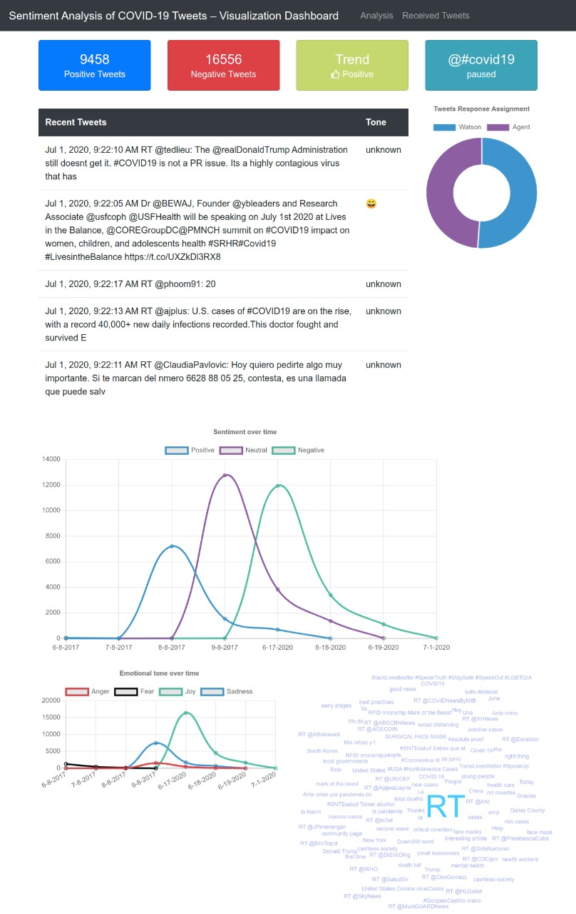
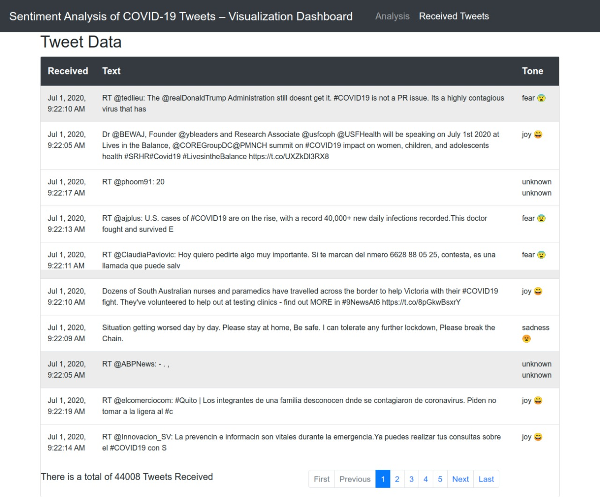

# SBSPS-Challenge-2128-Sentiment-Analysis-of-COVID-19-Tweets-Visualization-Dashboard
## Team Name: - X Æ A-4
In this project, our server application subscribes to a **LIVE** Twitter feed with hashtags of "Covid19". Each tweet received will be analyzed for emotional tone and sentiment, and the intent of the tweet will be determined by the Watson Assistant service. All data is stored in a Cloudant database. The resulting analysis is presented in a web-framework (dashboard) as a series of graphs and charts.

## Youtube
https://youtu.be/6VqK6cLwGZQ

## Power Point Presentation (ppt): - 
[PPT](docs/twitterSentiFinal.pptx)

## Live app link
> Note: - The link may or may not be active. We are using the free plan of IBM cloud service and as this project takes LIVE tweets this requires us to change the api credentials after certain period of time based on the number of tweets stored in the cloudant. 

> If you want to see the live demo, refer the youtube link given above or contact us to on the website at `2018.abhay.gupta@ves.ac.in`

[Dashboard Link](https://cognitive-social-crm-persistent-quokka-ch.eu-gb.mybluemix.net)


## Flow


1. Tweets are pushed out by Twitter.
2. The Sentiment Analysis of COVID-19 Tweets app processes the tweet.
3. The Watson Tone Analyzer Service performs analysis of sentiment and emotional tone.
4. The Watson Natural Language Understanding Service pulls out keywords and entities.
5. The Watson Assistant Service extracts the intents (verbs) from the tweets.
6. Tweets and metadata are stored in Cloudant
7. The dashboard displays charts and graphs as well as the tweets.

## Included components

- [Watson Assistant](https://www.ibm.com/cloud/watson-assistant/): Watson Assistant is a robust platform that allows developers and non-technical users to collaborate on building conversational AI solution.
- [Watson Tone Analyzer](https://www.ibm.com/watson/services/tone-analyzer): Uses linguistic analysis to detect communication tones in written text.
- [Watson Natural Language Understanding](https://www.ibm.com/watson/services/natural-language-understanding): Natural language processing for advanced text analysis.
- [IBM Cloudant](https://www.ibm.com/cloud/cloudant): A managed NoSQL database service that moves application data closer to all the places it needs to be — for uninterrupted data access, offline or on.
- [Cloud Foundry](https://www.cloudfoundry.org/): Build, deploy, and run applications on an open source cloud platform.

## Featured technologies

- [Artificial Intelligence](https://medium.com/ibm-data-science-experience): Artificial intelligence can be applied to disparate solution spaces to deliver disruptive technologies.
- [Databases](https://en.wikipedia.org/wiki/IBM_Information_Management_System#.22Full_Function.22_databases): Repository for storing and managing collections of data.
- [Angular](https://angular.io/): A framework to build UI for mobile and desktop application.
- [Node.js](https://nodejs.org/): An open-source JavaScript run-time environment for executing server-side JavaScript code.
- [Express](https://expressjs.com/): Fast, unopinionated, minimalist web framework for Node.js

# Steps

We can deploy the code to IBM Cloud (or run the code locally, there will be one more step to configure the credentials locally.)

1. [Install Dependencies](#1-install-dependencies)
2. [Twitter Requirements](#2-twitter-requirements)
3. [Create Watson services with IBM Cloud](#3-create-watson-services-with-ibm-cloud)
4. [Import the Assistant workspace](#4-import-the-assistant-workspace)
5. [Configure credentials](#5-configure-credentials)
6. [Run the application](#6-run-the-application)

### 1. Install dependencies

The application requires the following software to be installed locally.

1. [Node (6.9+)](https://nodejs.org): Application runtime environment, download and install the package.
2. [Angular CLI (6.1.1)](https://www.npmjs.com/package/@angular/cli): A CLI for Angular applications, installed with: `npm install -g @angular/cli`.
3. [Angular (6.1.0)](https://angular.io): Angular will be added as a dependency of client in `package.json` when setting up client using `Angular cli`.
4. [Express (4.16.3)](https://expressjs.com): Express will be added as a dependency in `package.json` for server.

> If you have Angular CLI already installed. Please read the upgrade instructions for Angular CLI when you upgrade the software.

Run the following command, from the application folder, to install both the client and server dependencies.

```
$ npm run app-install
```


### 2. Twitter requirements

To subscribe to Tweets from a specific handle or hashtag in this application, it is required to create a Twitter account and a Twitter application.
The Twitter account will be used as the account that receives the messages from other Twitter users as well as the owner of the application, required by Twitter, to receive Tweets.

- You can create a normal Twitter account on [Twitter](https://twitter.com/signup) or use an existing account. It is required to provide a unique email id that isn't already associated with an existing Twitter account as well as a phone number to verify the account.
- Once you have the Twitter account created and verified, log in to [Twitter Dev](https://developer.twitter.com/apps) and create an application.
- Select the Keys and Access Tokens tab and generate a Consumer Key and Secret.
  Keep this page open as you will need to use these tokens into setup procedure in the application later on.

### 3. Create Watson services with IBM Cloud

Either Setup the IBM Cloud Deployment or Setup Local Deployment.

#### Setup local Deployment

> Create the IBM Cloud services and configure them to use on a locally running server app.

If you do not already have a IBM Cloud account, [signup for IBM Cloud](https://cloud.ibm.com/registration).
Create the following services:

- [**Watson Assistant**](https://cloud.ibm.com/catalog/services/watson-assistant-formerly-conversation)
- [**Watson Tone Analyzer**](https://cloud.ibm.com/catalog/services/tone-analyzer)
- [**Watson Natural Language Understanding**](https://cloud.ibm.com/catalog/services/natural-language-understanding)
- [**IBM Cloudant DB**](https://cloud.ibm.com/catalog/services/cloudant)

>NOTE: When provisioning Cloudant, for `Available authentication methods` choose `Use both legacy credentials and IAM`


### 4. Import the Watson Assistant skill

- Find the Assistant service in your IBM Cloud Dashboard.
- Click on the service and then click on `Launch tool`.
- Go to the `Skills` tab.
- Click `Create new`
- Click the `Import skill` tab.
- Click `Choose JSON file`, and upload [this](data/assistant/workspace-social-crm-airline-classification.json). the workspace.json file in 
- Select `Everything` and click `Import`.

To find the `WORKSPACE_ID` for Watson Assistant:

- Go back to the `Skills` tab.
- Click on the three dots in the upper right-hand corner of the app and select `View API Details`.
- Copy the `Workspace ID` GUID.

### 5. Configure credentials
Fill in the requried details needed in the server/env.sample

Change it's name to ".env"

This is to be done before executing on the IBM server.

> The `.env` file is where all the parameters like credentials, log settings and other constants required by this application is kept.

#### Configure service credentials

The credentials for IBM Cloud services (Tone Analyzer, Natural Language Understanding, and Cloudant), can be found in the `Services` menu in IBM Cloud, by selecting the `Service Credentials` option for each service.

> NOTE: When provisioning Cloudant, for `Available authentication methods` choose `Use both legacy credentials and IAM`

From the root of the project, go to `server` folder (`cd server`) and

Add all the credentials that you have saved from creating the services, as explained earlier, in the `.env` file.

### 6. Run the application

Either `Run the app on IBM Cloud` or `Run the app locally`.

#### Running the app on IBM Cloud

1. Compile the Angular client code and Express server code using the following command. This creates a `dist` folder in your project root directory and copies the compile code and necessary files to be deployed to IBM cloud.

```
$ npm run build
```

2. Connect to IBM Cloud in the command line tool and follow the prompts to log in

```
$ ibmcloud cf login -a https://api.ng.bluemix.net
```

> Make sure you set the `target` and `space` correctly using `ibmcloud target -o <target> -s <space>`

3. Push the app to IBM Cloud.

```
$ ibmcloud app push
```

4. The application should now be running on IBM Cloud and listening to Tweets. You can get the application URL by going to `Cloud Foundry Applications` section of IBM cloud dashboard. Click the name of the application you just pushed and clikc `Visit App URL` to access the application.

#### Running the app locally

Once all the credentials are in place, the application can be started with:

```
$ npm run start
```

The server runs on port `3000` and the `client` runs on port `4200`. You can access the UI by accessing the following URL in the browser:

`http://localhost:4200`

## Sample Output

You will see informations about Tweets:



as well as Classification of live tweets, Sentiment over time, Emotional Tone over time, and Keywords mentioned:



## Team Members: -
Jay Jhaveri: https://github.com/JayJhaveri1906

Prem Chhabria: https://github.com/premchhabria

Abhay Gupta: https://github.com/abhay8463

Prasad Govekar: https://github.com/govekarmohit


